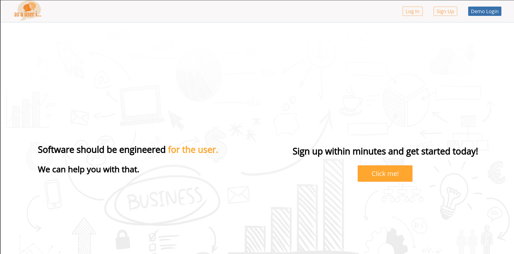
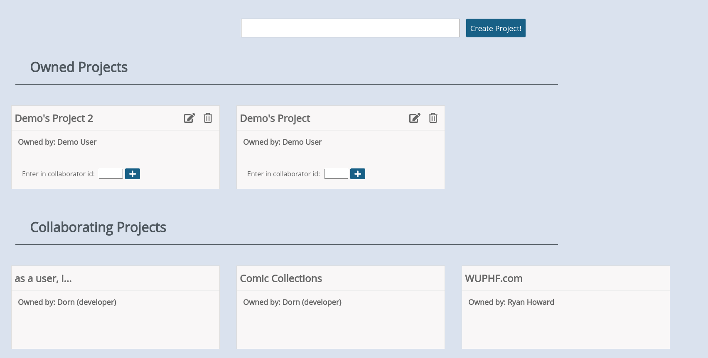
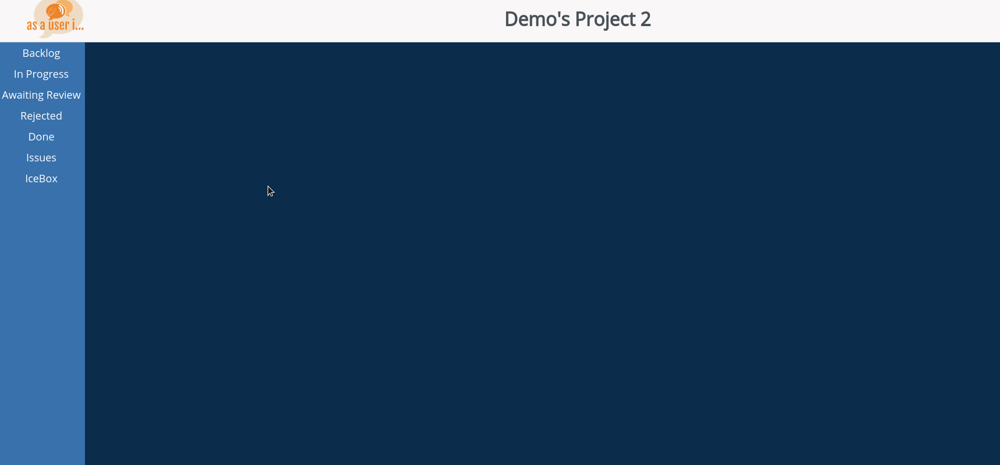
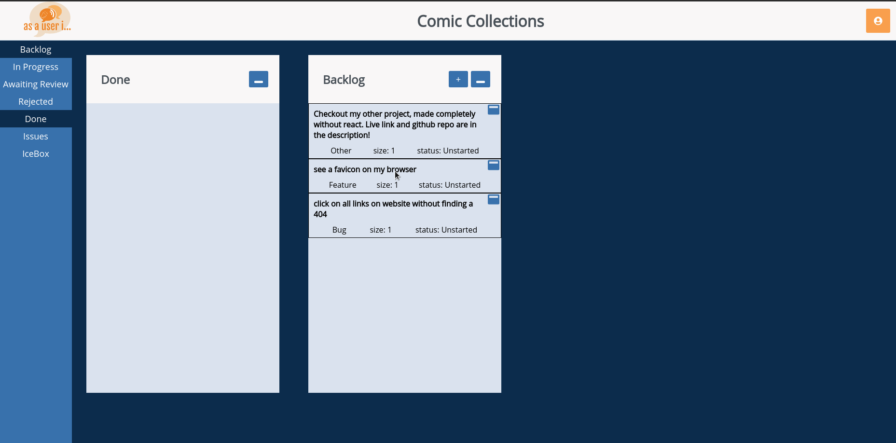
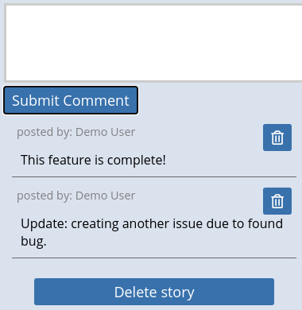

# as a user, i...
To see the production website, check out our live deployed link: https://as-a-user-i.herokuapp.com/projects

# General Description

*as a user, i...* is an organization tool meant for software developers.  This tool is a clone of pivotal tracker with the added emphasis of buildling software from the perspective of the end-user.

# Project Dashboard

Once logged in, the site will immediately redirect to the project dashboard.  Here, you can create new projects, view your owned projects and collaborating projects.

 Any owned projects will be immediately be deletable and editable asynchronously.  Collaborated projects have less priviliges.

Try out adding a collaborator to your project!  You can find your personal collaborator id on the profile dropdown on the top-right.

# Workspace 
Clicking on a project will then bring you to your workspace.  In the workspace, you will see a sidebar with togglable buttons to spawn windows.  These windows are drag and droppable for easy organization.

The icebox, issues and backlog windows can be used to create stories. The status of these stories can be changed by pressing the buttons on the top right.  These stories are also drag and droppable for reordering or changing the status of the story.

Comments can also be added and deleted on any story.

