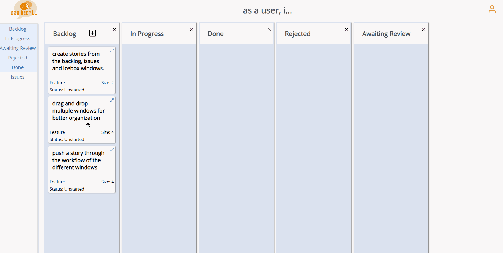

# as a user, i...
To see the production website, check out our live deployed link: **link has been removed, awaiting deployment ticket*

# General Description

*as a user, i...* is an organization tool meant for software developers.  This tool is a clone of pivotal tracker with the added emphasis of buildling software from the perspective of the end-user.

# Signup / Login

Feel free to sign up and create and account on this application.  The auth flow has standard security with password hashing.  If not, feel free to use the demo login provided to check out the features of the application.  The Demo User has full features of the application.

# Project Dashboard

Once logged in, the site will immediately redirect to the project dashboard.  Here, you can create new projects, view your owned projects and collaborating projects.

 Any owned projects will be immediately be deletable and editable asynchronously.  Collaborated projects have less privileges.

Try out adding a collaborator to your project!  You can find your personal collaborator id on the profile dropdown on the top-right.

# Workspace 
Clicking on a project will then bring you to your workspace.  In the workspace, you will see a sidebar with togglable buttons to spawn windows.  These windows are drag and droppable for easy organization.

The issues and backlog windows can be used to create stories. 

These stories are also drag and droppable for reordering or changing the status of the story.  The status of these stories can be changed by pressing the buttons on the top right.  

Comments can also be added and deleted on any story.

# Tech Information

This project is built on a ReactJS frontend and NodeJS backend using Express.  The database is a PostGres relational database.

# Development Info

If you'd like to spin up this application locally, you can do so with the following steps: 

## Spin up PostGresSql container

Spin up a local postgres container listening on port 5672.  This is done easiest by pulling the latest postgres docker image.

## Start up backend

Set your working directory as `as_a_user_i/backend`.  Then run the following commands to seed your database using the sequelize-cli (installing sequelize may be necessary for the following steps to work.)

    npm install
    npx run sequelize-cli db:create
    npx run sequelize-cli db:migrate
    npx run sequelize-cli db:seed:all

Once your database is set up, run the following to start the backend nodejs server: 

    npm run start

## Start up UI

To start the UI, make sure the backend API is currently running.  Then run the following from the `as_a_user_i/frontend` directory: 

    npm install
    npm run start

## Spin up backend with frontend build (for deployments)

You can also build the frontend into a production build and then deploy the app from running the frontend.

    npm run install
    npm run build
    npm run start